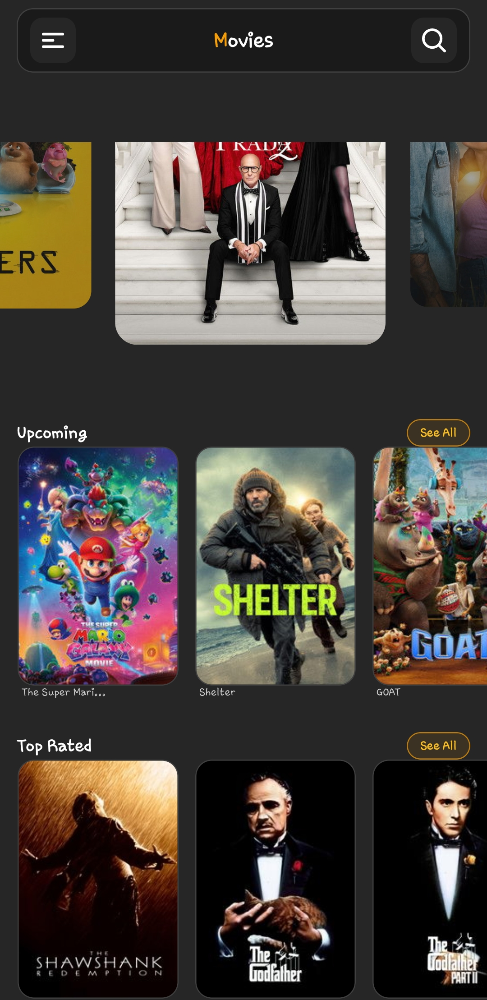
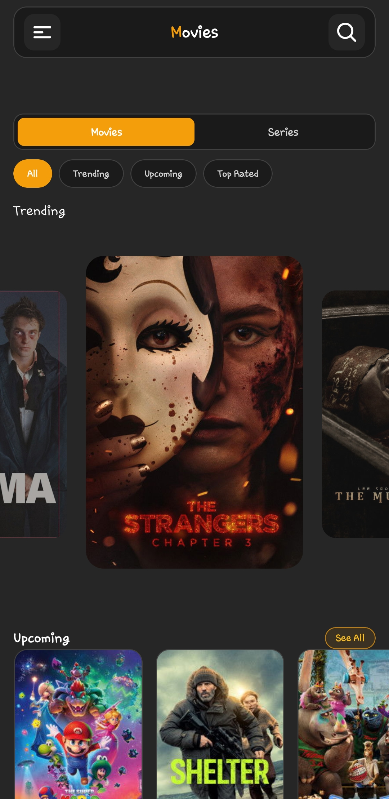
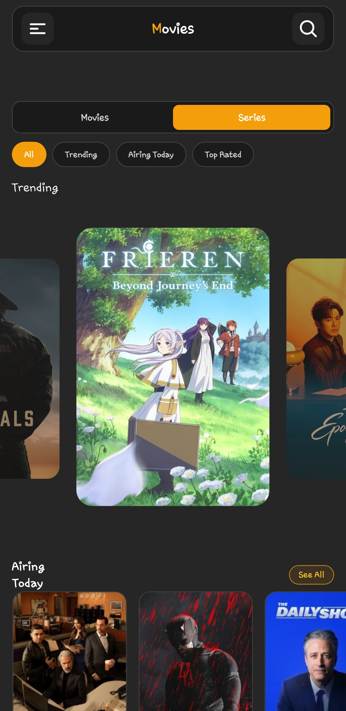
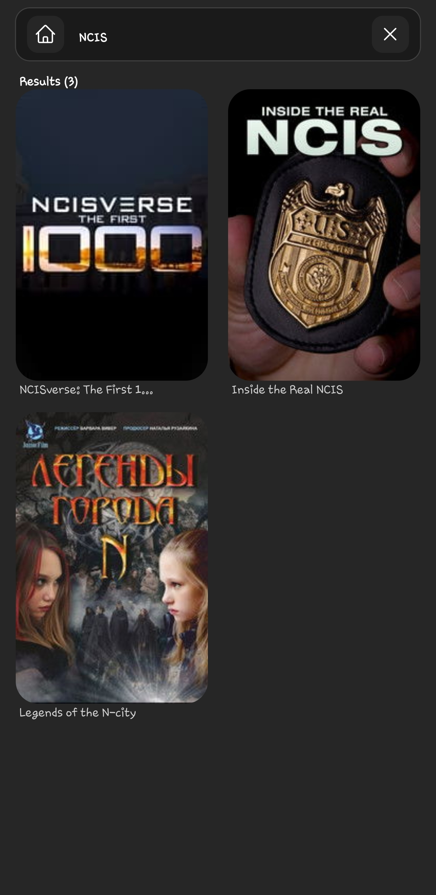
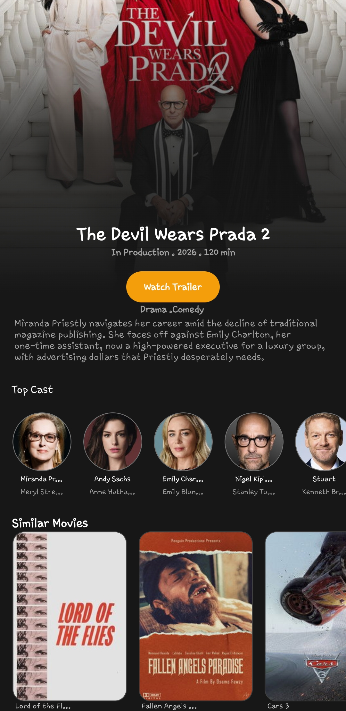
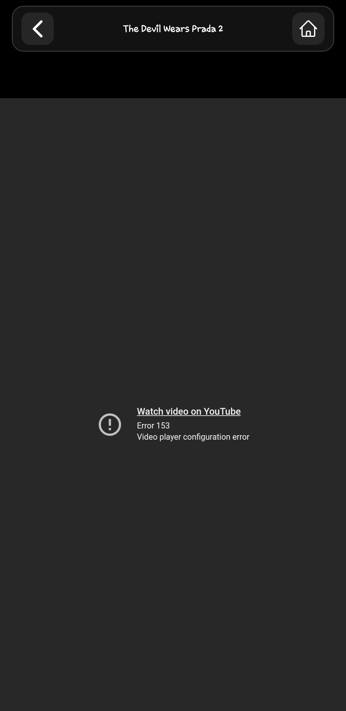
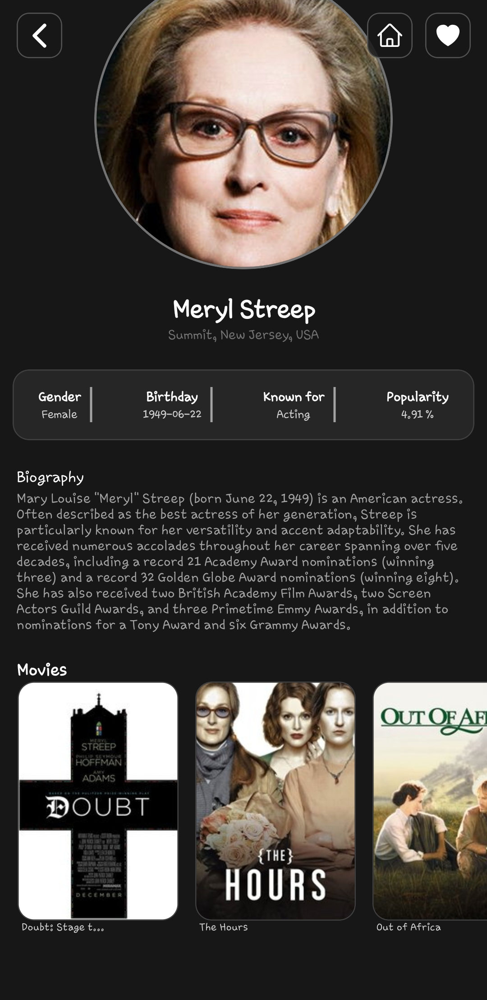

# Movie App (Expo + React Native)

A modern mobile movie/series discovery app powered by TMDB APIs, built with Expo Router and React Native.

## Features

- Browse both **Movies** and **Series** from Home.
- Filter content by:
  - `All`
  - `Trending`
  - `Upcoming` / `Airing Today`
  - `Top Rated`
- Open **See All** pages with infinite scroll pagination.
- View detailed pages with:
  - overview
  - runtime/year/status
  - cast members
  - similar titles
- Open person profile details from cast cards.
- Search screen with debounced API search + loading skeleton.
- In-app trailer playback screen with fallback handling.
- Home shortcuts and quick actions (menu/search/home buttons).

## Screenshots

### 1) Home Dashboard


The landing screen that introduces the app layout. It highlights trending content first, then provides section-based browsing with quick access to search and menu actions.

### 2) Movies Toggle View


Shows the Home screen in **Movies** mode, where users can filter and browse movie-specific sections like Trending, Upcoming, and Top Rated.

### 3) Series Toggle View


Shows the Home screen in **Series** mode, where the same filtering system is applied to TV content (Trending, Airing Today, Top Rated).

### 4) Search Screen


Dedicated screen for finding titles quickly. It supports debounced search input, loading placeholders, and clean result cards for fast navigation.

### 5) Movie Details


Provides full title context including metadata, overview, cast, similar titles, and trailer access from one screen.

### 6) Watch Trailer


In-app trailer playback view using WebView. Users can watch without leaving the app, with fallback behavior for restricted videos.

### 7) Profile Details


Person profile page opened from cast members. It shows actor details, biography, and related credited titles.

## Tech Stack

- **Framework:** Expo SDK 54
- **Language:** TypeScript
- **Routing:** Expo Router (file-based)
- **Networking:** Axios
- **Styling:** NativeWind / Tailwind classes
- **Media:** `react-native-webview` for in-app trailer playback

## Project Structure

- `app/`
  - `index.tsx` - Home dashboard, movies/series toggle, filter chips.
  - `movieDetails.tsx` - Unified details for movie + TV.
  - `personDetails.tsx` - Person profile details and credits.
  - `searchScreen.tsx` - Debounced title search.
  - `seeAll.tsx` - Paginated full list screen.
  - `watchTrailer.tsx` - In-app trailer player.
  - `_layout.tsx` - Route registration and stack config.
- `components/`
  - `trendingMovies.tsx` - Carousel for trending content.
  - `movieList.tsx` - Horizontal section list + See All.
  - `castMembers.tsx` - Cast strip with navigation to person details.
- `api/moviedb.tsx` - All TMDB endpoint wrappers and API helpers.

## Getting Started

### 1) Install dependencies

```bash
npm install
```

### 2) Configure environment variables

Create/update `.env`:

```env
EXPO_PUBLIC_API_KEY=your_tmdb_api_key
```

### 3) Run the app

```bash
npx expo start
```

If Metro cache causes stale behavior:

```bash
npx expo start -c
```

## Scripts

- `npm run start` - Start Expo dev server
- `npm run android` - Open Android target
- `npm run ios` - Open iOS target
- `npm run web` - Open web target
- `npm run lint` - Run lint checks

## How Data Flows

1. Screen/component calls helper from `api/moviedb.tsx`.
2. Helper delegates request through shared `apiCall(...)`.
3. API data is normalized with `media_type` where needed.
4. UI renders lists/details and routes to next screen with params.

## Notes and Limitations

- Some trailers are not embeddable in WebView due to YouTube/video owner restrictions.
- For unavailable trailers, the app provides fallback messaging.
- API rate limits and region/content availability are controlled by TMDB.

## Troubleshooting

- **Missing API data / empty lists**
  - Confirm `EXPO_PUBLIC_API_KEY` is set correctly.
- **Bundling issues after file changes**
  - Run `npx expo start -c`.
- **Trailer not playing**
  - The specific video may be restricted for embedding.

## Roadmap Ideas

- Add authentication and personal watchlist/favorites persistence.
- Add genre-based advanced filters.
- Add server-driven recommendations.
- Add offline caching for previously visited lists/details.
